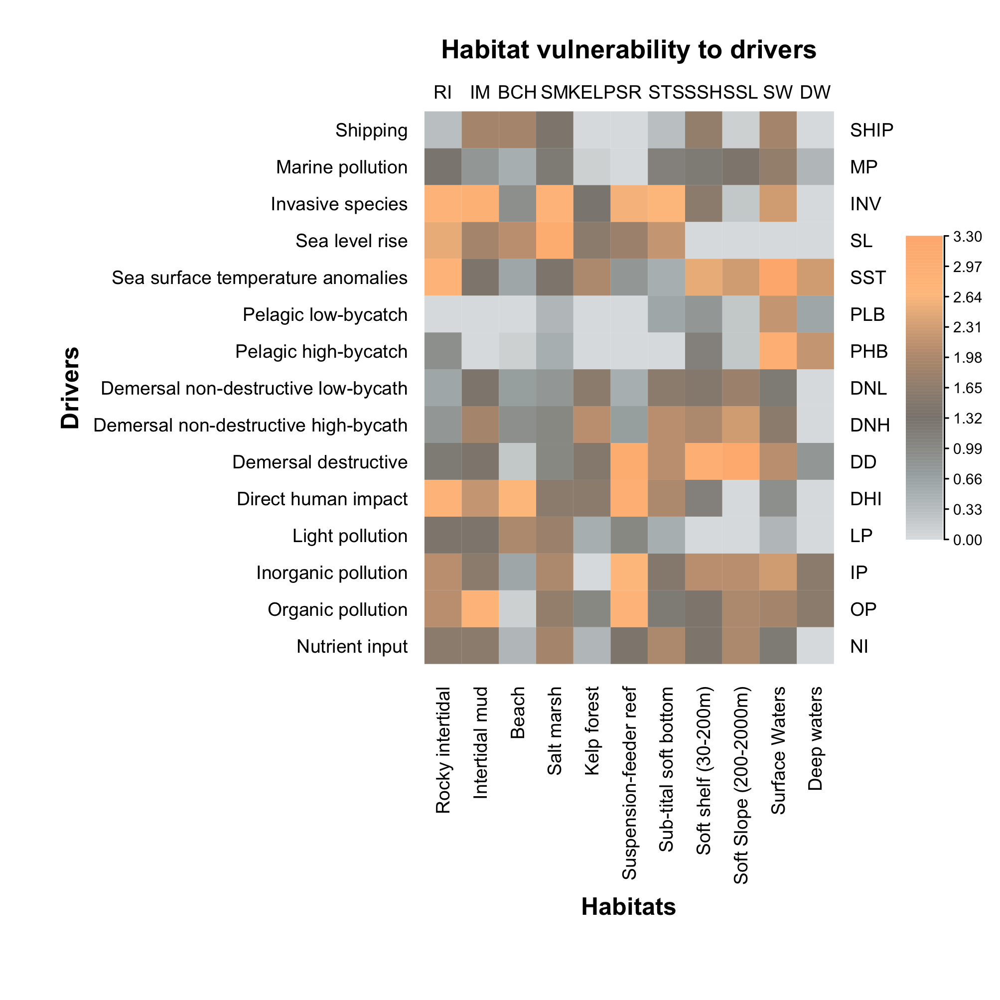

<!--
rmarkdown::render('./Document_Methode.md', 'pdf_document')
rmarkdown::render('./Rapport/Document_Methode/Document_Methode.md', 'word_document')
-->

\newpage

<!-- =-=-=-=-=-=-=-=-=-=-=-=-=-=-=-=-=-=-=-=-=-=-=-=-=-=-=-=-=-=-=-=-=-=-=-= -->
# Contexte
<!-- =-=-=-=-=-=-=-=-=-=-=-=-=-=-=-=-=-=-=-=-=-=-=-=-=-=-=-=-=-=-=-=-=-=-=-= -->

Transports Canada élabore et applique des politiques et des règlements pour faire progresser la sécurité et la sûreté du système de transport maritime du Canada. Le Ministère favorise un réseau efficace et durable qui protège l’environnement maritime et contribue au développement économique.

En novembre 2016, le gouvernement du Canada a annoncé le Plan national de protection des océans (PPO) au montant de 1,5 milliard de dollars ayant pour objectif d’améliorer la sécurité maritime et la navigation responsable, de protéger le milieu marin canadien et d’offrir de nouvelles possibilités pour les Canadiens.

Grâce à ce plan, le gouvernement du Canada est résolu à conserver et à restaurer les écosystèmes marins côtiers qui sont vulnérables à l’augmentation du trafic maritime, tout en réduisant l’incidence du trafic maritime quotidien. De nombreuses préoccupations ont été exprimées concernant l’augmentation du transport maritime et l’impact des autres activités maritimes (un secteur d’activités pouvant être une source importante d’impacts anthropiques) sur les écosystèmes côtiers et maritimes ainsi que sur le mode de vie des communautés autochtones.

Afin de faciliter une meilleure coordination, Transports Canada et le gouvernement du Québec, dans le cadre du Plan d’action Saint-Laurent , ont joint leurs efforts visant le développement et l’application d’un cadre commun d’évaluation des effets cumulatifs des activités maritimes actuelles et futures sur le Saint-Laurent et le Saguenay tout en encourageant une étroite collaboration avec les Premières Nations, les intervenants maritimes et les collectivités côtières.

Transports Canada collabore avec les communautés autochtones, les intervenants de l’industrie maritime et les collectivités côtières depuis 2017 et continuera à organiser des ateliers collaboratifs pour faire en sorte que toutes les parties soient impliquées de manière égale tout au long du projet.

<!-- =-=-=-=-=-=-=-=-=-=-=-=-=-=-=-=-=-=-=-=-=-=-=-=-=-=-=-=-=-=-=-=-=-=-=-= -->
# Description de l'aire d'étude
<!-- =-=-=-=-=-=-=-=-=-=-=-=-=-=-=-=-=-=-=-=-=-=-=-=-=-=-=-=-=-=-=-=-=-=-=-= -->

L'évaluation intégrée des impacts cumulatifs des activités maritimes sera effectuée sur les écosystèmes du Saint-Laurent entre Montréal et Pointe-des-Monts et de la rivière Saguenay pour la partie profonde jusqu'à Saint-Fulgence (Figure 1).

***Description sommaire et carte géographique à venir***

<!-- Demander les shapefile qui décrivent l'aire d'étude pour que je puisse commencer à faire des cartes. -->

<!-- =-=-=-=-=-=-=-=-=-=-=-=-=-=-=-=-=-=-=-=-=-=-=-=-=-=-=-=-=-=-=-=-=-=-=-= -->
# Mandat
<!-- =-=-=-=-=-=-=-=-=-=-=-=-=-=-=-=-=-=-=-=-=-=-=-=-=-=-=-=-=-=-=-=-=-=-=-= -->

## Titre du projet

Évaluation des effets cumulatifs des activités maritimes sur le Saint-Laurent ainsi que la rivière Saguenay

## Objectif

Transports Canada requiert les services d’un entrepreneur pour développer une méthodologie d’analyse et effectuer l’évaluation des effets cumulatifs des activités maritimes dans le Saint-Laurent (tronçon fluvial et estuaire) et la rivière Saguenay (partie en eau profonde) au Québec.

Ce projet appuiera Transports Canada et le gouvernement du Québec dans la conception d’un cadre commun d’évaluation des effets cumulatifs des activités maritimes; et permettra d’identifier des outils et des stratégies d’atténuation pouvant s’appliquer aux déplacements actuels de navires et au développement de projets futurs. Le tout sera effectué de façon collaborative afin d’assurer la coordination entre les Premières Nations, les scientifiques et les organismes de réglementation et de prendre des décisions fondées sur des éléments probants.

## Description des besoins

L`entrepreneur doit développer une méthodologie d’analyse des effets cumulatifs des activités maritimes qui sera présentée aux différents collaborateurs.
En utilisant cette méthodologie, l’entrepreneur doit effectuer l’évaluation des effets cumulatifs des activités maritimes sur les composantes valorisées identifiées par les Premières Nations et diverses parties prenantes pour le Saint-Laurent (tronçon fluvial et estuaire) et la rivière Saguenay (partie en eau profonde) au Québec.

À partir de cette évaluation, l’entrepreneur doit produire un rapport résumant la méthodologie employée, l’analyse effectuée, les résultats et les conclusions qui seront présentés aux différents collaborateurs.

L`entrepreneur doit aussi participer aux ateliers de travail et discussion avec les Premières Nations, les intervenants maritimes et les collectivités côtières afin de bien intégrer les commentaires et l’apport de chacun.

## Portée

L’entrepreneur doit fournir une évaluation intégrée des impacts cumulatifs des activités maritimes sur les écosystèmes du Saint-Laurent (tronçon fluvial et estuaire, i.e. de Montréal à Pointe-des-Monts) et du Saguenay (partie en eau profonde jusqu’à Saint-Fulgence), être en mesure de caractériser la structure spatiale de certaines composantes valorisées ciblées du Saint-Laurent et du Saguenay, évaluer la vulnérabilité de ces composantes à de multiples facteurs de stress (dont la source est liée aux activités maritimes), et évaluer les impacts cumulatifs à partir de la cartographie des facteurs de stress et des composantes valorisées. Cette étude favorisera une évolution vers une manière plus proactive et holistique de gérer les écosystèmes marin et dulcicole.

La collaboration avec les Premières Nations et l’intégration du savoir autochtone est une exigence. L’entrepreneur doit, entre autres, se baser sur les discussions et conclusions des ateliers de travail avec les représentants des Premières Nations et autres parties prenantes pour l’élaboration du projet. Les savoirs autochtones, lorsque disponibles, devront être considérés dans les données qui aideront à détecter les changements dans le milieu et à améliorer notre compréhension des effets cumulatifs.

## Tâches et services détaillés

L’entrepreneur doit accomplir les tâches et activités suivantes :

### Lancement du projet, planification du travail et réunions d’avancement

Une réunion de lancement en personne sera organisée dans les deux (2) semaines suivant l’attribution du contrat (début février). L’objectif de la réunion consiste, au moins, à présenter l’équipe de l’entrepreneur et à discuter du plan de travail et de l’approche proposée, de l’affectation des ressources et du calendrier de l’entrepreneur. L’échéancier de remise du premier rapport d’étape (voir ci-après) sera déterminé durant la réunion de lancement. L’entrepreneur doit soumettre un plan de travail préliminaire aux fins d’approbation par le chargé de projet durant la semaine suivant la réunion de lancement.

De plus, l’entrepreneur doit prévoir des réunions/téléconférences mensuelles avec le chargé de projet pour faire le point sur le projet et/ou fournir les résultats préliminaires. Ceci peut inclure :

- un résumé des dernières activités réalisées;
- ce qui a été effectué et ce qui était prévu, mais qui n’a pas été réalisé;
- ce qui est prévu jusqu’à la prochaine réunion;

Les questions, les problèmes et les avertissements devront être signalés au chargé de projet à mesure qu’ils surviennent.

### Participation aux ateliers/webinaires de travail

La participation à divers ateliers de travail avec les collaborateurs et partenaires est un prérequis. L’entrepreneur doit se baser sur les discussions et conclusions de ces ateliers pour l’élaboration du projet.

Le premier atelier se tiendra le 11 février 2020 et permettra de bien identifier la portée de l’évaluation, i.e. les composantes valorisées et les facteurs de stress (des composantes potentielles sont la qualité de l’eau, les habitats de reproduction des poissons, espèces en péril, activités traditionnelles telles que la pêche aux mollusques). La portée couverte par l’analyse de l’entrepreneur sera consolidée avec Transports Canada, le gouvernement du Québec et les autres partenaires et collaborateurs avant la fin février 2020.

Lors d’un webinaire au début avril 2020, l’entrepreneur doit présenter l’approche suggérée pour l’évaluation afin d’obtenir l’approbation du chargé de projet et des collaborateurs. L’entrepreneur doit remettre à Transports Canada le document présentant l’aperçu de la méthode d’évaluation à la mi-mars 2020 afin que les participants puissent examiner les documents avant de participer aux discussions.

Dans un atelier prévu en mars 2021, l’entrepreneur doit présenter les constatations préliminaires de l’évaluation à des fins de discussion avant de produire le rapport final. L’entrepreneur doit remettre à Transports Canada le rapport préliminaire trois (3) semaines avant l’atelier afin que les participants puissent examiner les documents avant de participer aux discussions.

La présentation du rapport final lors d’un atelier doit se faire au début du mois de février 2022. L’entrepreneur doit remettre à Transports Canada le rapport avant le 31 décembre 2021.

### Développement de la méthodologie

La méthode d’analyse utilisée doit être en mesure :

- d’intégrer les connaissances autochtones et traditionnelles recueillies par Transports Canada auprès des communautés autochtones;
- d’utiliser différents types de données, notamment les données géo-spatiales et tabulaires (non géo-référencées);
- d’étudier des limites spatiales et temporales variables;
- de caractériser des sources de stress environnementaux multiples;
- d’évaluer de façon intégrée les répercussions sur diverses composantes valorisées (identifiées lors des ateliers de travail), notamment les composantes biologiques, environnementales, culturelles et socioéconomiques. Les répercussions positives potentielles des activités maritimes (p. ex. : réduction des émissions de gaz à effet de serre et répercussions socio-économiques positives) doivent aussi pouvoir être prises en considération.

### Évaluation des effets cumulatifs

Cette évaluation doit inclure une caractérisation de la structure spatiale des composantes valorisées (portrait de l’aire d’étude), l’état de vulnérabilité des composantes à de multiples facteurs de stress découlant des activités maritimes , et l’analyse des impacts cumulatifs à partir de la cartographie des facteurs de stress (incluant leurs sources) et des composantes valorisées.

L’étendue de l’analyse est déterminée par les éléments suivants :

- la définition des facteurs de stress clés des activités maritimes pouvant influencer des composantes valorisées potentielles dans le secteur visé (effectué lors des ateliers de travail de novembre 2017 et juin 2018);
- la sélection de limites spatiales et temporelles appropriées dans le site visé (effectué en collaboration avec les partenaires en 2018);
- la détermination de liens entre les facteurs de stress décelés des activités maritimes et les composantes valorisées sélectionnées (supporté par un exercice du Secrétariat canadien de consultation scientifique effectué en novembre 2019);

La collecte et le regroupement de données actuelles sur les activités maritimes régionales, les données environnementales, culturelles et traditionnelles seront effectués en collaboration avec les diverses parties prenantes.

Les données recueillies pour effectuer l’analyse doivent être conservées dans une base de données qui sera éventuellement utilisé pour le partage d’information sur le Saint-Laurent et le Saguenay avec les diverses parties prenantes.

Une discussion doit avoir lieu avec l’entrepreneur pour échanger sur la meilleure façon de communiquer au public l'information recueillie dans le cadre de cette évaluation.

### Rapport préliminaire

L’entrepreneur doit préparer une ébauche du rapport comprenant les constatations préliminaires. Celui-ci doit être remis à Transports Canada pour questions et commentaires trois (3) semaines avant l’atelier du mois de mars 2021.

### Rapport final

L’entrepreneur doit intégrer les commentaires reçus lors de l’atelier sur le rapport d‘évaluation provisoire et fournir un rapport final avant le 31 décembre 2021.

### Calendrier des livrables

| Description ou « livrable » | Échéance |
| :-------------------------- | :------- |
| Lancement et préparation du calendrier et du plan de travail | Deux (2) semaines suivant l’attribution du contrat (début février 2020)
| Document présentant un aperçu de la méthode d’évaluation des impacts cumulés et de l'approche de collecte et de gestion des données | Mi-mars 2020 |
| Présentation du document méthodologique aux partenaires et collaborateurs pour commentaires et approbation par webinaire | Avril 2020 |
| Rapport sommaire et présentation des constatations préliminaires aux fins de commentaires lors d’un atelier | Mars 2021 |
| Livraison du rapport final aux fins de traduction et de diffusion | Le ou avant le 31 décembre 2021 |
| Présentation du rapport final lors d’un atelier | Début février 2022|

Le chargé de projet examinera chaque produit livrable et indiquera l’approbation et l’acceptation ou la nécessité pour l’entrepreneur d’apporter des révisions.

En plus de fournir les livrables prévus, l’entrepreneur est chargé des activités suivantes : s’assurer que les travaux sont planifiés adéquatement, qu’ils sont organisés et effectués par du personnel expérimenté et compétent; au besoin, organiser les réunions qui s’imposent; fournir son propre soutien administratif et logistique.

### Format des livrables

L’entrepreneur fournira les documents suivants en français par courriel au chargé de projet :

- des versions électroniques du rapport préliminaire et du rapport final en format Microsoft Word et en format PDF;
- la liste complète et la documentation/bibliographie ainsi que les sources de données;
- les ensembles de données, les modèles/tableurs ainsi que la méthodologie qui ont été conçus pour appuyer l’analyse, y compris les explications et les références;
- les bases de données devront être livrées dans un format facilitant l’accès par Transports Canada; elles devront contenir la définition des champs ainsi que la description des données.
- un format qui permet d’optimiser l’accès et le partage des connaissances/données à de multiples organismes.

### Soutien fourni par le Canada

Le chargé de projet de Transports Canada fournira à l'entrepreneur tous les documents de référence nécessaires et pertinents et sera disponible pour répondre aux questions tout au long du projet, au besoin. Il contribuera à la collecte de données qui aideront à détecter les changements dans le milieu et à améliorer notre compréhension des effets cumulatifs.

### Réunions, ateliers et déplcaements

L’entrepreneur doit participer aux téléconférences qui se tiendront une fois par mois avec le chargé de projet de Transports Canada. Il peut également être invité à participer, en personne ou par conférence téléphonique, aux réunions interministérielles (approximativement 2), qui se tiendront en général dans la ville de Québec.

Dans le cadre de ce contrat, l’entrepreneur doit être présent en personne à trois (3) ateliers qui se tiendront dans les villes de Québec ou Montréal.

<!-- =-=-=-=-=-=-=-=-=-=-=-=-=-=-=-=-=-=-=-=-=-=-=-=-=-=-=-=-=-=-=-=-=-=-=-= -->
# Équipe de travail
<!-- =-=-=-=-=-=-=-=-=-=-=-=-=-=-=-=-=-=-=-=-=-=-=-=-=-=-=-=-=-=-=-=-=-=-=-= -->

Philippe Archambault agira à titre de gestionnaire de projet. Détenteur d’un doctorat en biologie (1998), il a d’abord été chercheur à Pêches et Océans Canada (2000-2007) puis professeur à l’Institut des sciences de la mer de l’Université du Québec à Rimouski (2007-2017). Depuis 2017, il est professeur à l’Université Laval. Alliant recherche fondamentale et théorique, Philippe étudie les effets de perturbations diverses (d’origine naturelle et anthropique) sur les écosystèmes depuis plus de 20 ans. Il a co-dirigé ou participé à de nombreux programmes de recherche axés sur la biodiversité benthique autant au niveau canadien qu’à l’international. Les résultats de ses travaux ont été utilisés, entre autres, pour le développement d’aires marines protégées et il est l’auteur/coauteur de > 120 articles scientifiques revus par les pairs. Il possède les compétences linguistiques orales, de compréhension et écrites à des niveaux de français et d’anglais avancés. Il supervise une équipe de > 25 personnes, incluant des étudiants gradués et des professionnels de recherche. Dans le cadre de ce projet, Philippe Archambault endossera le rôle de gestionnaire de projet. Il sera conséquemment responsable de la supervision du projet et aura la responsabilité du respect des échéanciers et de la production des livrables.

David Beauchesne est le post-doctorant pressenti pour la réalisation de ce projet. Fort de son expérience développée en cours de doctorat, David a toutes les qualifications requises pour mener à bien les travaux sur les effets cumulatifs des activités maritimes. Il possède les compétences linguistiques orales, de compréhension et écrites à des niveaux de français et d’anglais avancés.

Un étudiant de premier cycle universitaire pourrait prendre part à ce projet en tant qu’auxiliaire de recherche. Cet auxiliaire de recherche pourrait être embauché à temps complet pendant l’été, ou encore à temps partiel en cours d’année scolaire. Le candidat sera choisi suite à un affichage conforme aux procédures de l’Université Laval et devra détenir de l’expérience en système d’information géographique et en programmation.

<!-- =-=-=-=-=-=-=-=-=-=-=-=-=-=-=-=-=-=-=-=-=-=-=-=-=-=-=-=-=-=-=-=-=-=-=-= -->
# Approche méthodologique
<!-- =-=-=-=-=-=-=-=-=-=-=-=-=-=-=-=-=-=-=-=-=-=-=-=-=-=-=-=-=-=-=-=-=-=-=-= -->

## Démarche

Plusieurs ouvrages provenant de la littérature scientifique et la littérature grise détaillent les différentes étapes d'une évaluation d'impacts cumulés [*e.g.* @hegmann1999]. L'équipe de Transport Canada a travaillé, au cours des dernières années, avec plusieurs experts Canadiens et à l'international sur la démarche à adopter afin d'évaluer les impacts cumulés des activités maritimes [*e.g.* @lerner2018; @pickard2019]. En plus de l'importance des processus de concertation et de consultation des communautés autochtones et locales, et des parties prenantes, une évaluation d'effets cumulés inclut généralement les étapes suivantes, sans toutefois s'y limiter:

<!-- Éventuellement utiliser un schéma conceptuel qui inclue également les consultations avec les comunautés locales et autochtones -->

1. Identifier et impliquer les parties prenantes de l'évaluation (*p.ex.* communautés autochtones et locales)

2. Définir la portée de l'évaluation
    * Établir les objectifs de l'évaluation
    * Définir les limites spatiales et temporelles de la zone à l'étude
    * Identifier les activités préoccupantes et les facteurs de stress qui en découlent
    * Identifier et prioriser les composantes valorisées sur lesquelles l'évaluation doit être effectuée

3. Établir un portrait de la zone à l'étude
    * Caractériser l'intensité, l'étendue et la fréquence des activités et facteurs de stress.
    * Caractériser les composantes valorisées
    * Évaluer la vulnérabilité des composantes valorisées aux facteurs de stress

4. Analyse des effets cumulés

5. Diagnostic de l'analyse
    * Composantes valorisées à risque
    * Identifier les sources d'incertitude et les lacunes en connaissances

6. Mise en place de processus décisionnels
    * Identifier et mettre en place des mesures de gestion
    * Identifier des mesures d'atténuation et de compensation

7. Suivi et gestion adaptative

L'identification et l'implication des parties prenantes (1) et la définition de la portée de l'évaluation (2) a déjà été effectuée au préalable à travers plusieurs séances de concertation et d'atelier de travail avec des experts dans le domaine. À la lumière de ces processus, nous nous concentrons maintenant sur le portrait de la zone à l'étude (3), l'analyse des effets cumulatifs (4) et l'évaluation critique de l'analyse (5).

## Portrait de la zone d'étude

### Considérations particulières

L'évaluation des effets cumulés mandatée est explicitement spatiale: elle doit donc fournir une évaluation de la distribution spatiale et de l'intensité de effets cumulés dans la région à l'étude. Ce type d'approche régionale impose quelques contraintes, notamment la nécessité d'utiliser principalement des facteurs de données dont une caractérisation spatiale est disponible. Ceci rend l'utilisation d'études ponctuelles difficile, *p.ex* une évaluation de l'état d'une population d'anguille à l'embouchure d'une rivière.

De plus, dans le cadre de cette étude pilote, nous nous concentrons sur une évaluation contemporaine des effets cumulés; les données historiques permettant l'établissement d'états de références ne seront ainsi pas utilisées, à moins qu'un besoin particulier soit identifié. Bien que pertinent, le contexte de l'étude et la disponibilité des données ne nous permet pas d'évaluer un état de référence pour l'ensemble des éléments caractérisés, limitant ainsi les conclusions temporelles que nous pourrions en tirer.

La disponibilité des données guidera le travail que nous pouvons accomplir pour ce projet pilote. Le contexte de l'étude empêche une collecte de nouvelles données. Le portrait établi représentera ainsi une veille des connaissances actuelles permettant de caractériser les facteurs de stress des activités maritime ainsi que les composantes valorisées identifiées.

Finalement, plusieurs autres activités humaines peuvent être à la source de stress environnementaux dans l'aire d'étude. Par exemple, la qualité de l'eau est assurément influencée par les activités en milieu terrestre et le lessivage des terres agricoles par les embouchures de rivière. Par contre, la présente étude ne se concentre que sur les activités maritimes et les facteurs de stress qui en découlent.

### Activités et facteurs de stress

Le portrait débute par une caractérisation de la distribution et de l'intensité des facteurs de stress reliées aux activités maritime au sein de l'aire d'étude. Les activités maritimes et les facteurs de stress qui en découlent ont été identifiés lors d'activités de concertation et d'ateliers de travail avec des experts du milieu (Tableau 1). La liste identifiée est reprise pour ce rapport et nous recenserons les données disponibles nous permettant de caractériser les facteurs de stress environnementaux provenant des activités maritime. Chaque source de stress sera caractérisée individuellement en employant une méthode adéquate menant à la cartographie de sa distribution et de son intensité. Par exemple, des approches différentes devront être utilisées afin de caractériser les déplacements maritimes, dont les tracés pourraient être utilisés afin d'évaluer une intensité de trafic, et les activités de dragage, dont les sites pourraient être caractérisés en fonction de la quantité totale de sédiments dragués. Les méthodes spécifiques utilisées dépendront de la disponibilité des données et des stresseurs spécifiques et seront donc décrites plus tard dans le processus. Cette étape permettra d’utiliser et de valoriser des données disponibles sous différents formats (p.ex. géospatial et tabulaire) et à différentes résolutions spatiales et temporelles. Au terme de la caractérisation individuelle, les facteurs de stress multiples seront intégrées au sein d'une base de données intégrative qui permettra l'étude de stresseurs cumulés dans la région à l'étude.

Tableau 1. Liste des activités maritimes identifiées pour l'étude pilote sur les effets cumulatifs des activités maritimes au sein du Saint-Laurent.

| **Activité maritimes**        |
| :------------------------ |
| Dragage                   |
| Ancrages                  |
| Échouements & naufrages   |
| Rejets opérationnels      |
| Déversements accidentels  |
| Navigation                |
| Engins de pêche           |

### Composantes valorisées

Les composantes valorisées -- *c.-à-d.* les composantes biologiques, environnementales, culturelles ou socioéconomiques sur lesquelles l'analyse d'effets cumulatifs est effectuée -- ont été identifiées au préalable lors d'activités de concertation et d'ateliers de travail avec des experts du milieu (Tableau 2). Les composantes valorisées ont été sélectionnées séparément pour le tronçon fluvial (Montréal à la rivière Saguenay) et maritime (rivière Saguenay et l'estuaire) du Saint-Laurent. La liste des composantes valorisées identifiée sera utilisée pour ce rapport et nous recenserons les données disponibles nous permettant d'en effectuer une caractérisation spatiale au sein de l'aire à l'étude. Tout comme pour les sources de stress environnementaux, les composantes valorisées seront individuellement caractérisées selon une méthodologie appropriée et intégrées au sein d'une base de données intégrative couvrant la zone à l'étude. Les méthodologies décrivant les composantes valorisées dépendront de la disponibilité des données et des composantes valorisées spécifiques. Les méthodologies devront donc être décrites plus tard dans le processus. De plus, la caractérisation des composantes valorisées sera effectuée selon la disponibilité des données et en permettant à l'équipe de respecter les échéances du contrat. Il s'agit d'une importante liste de composantes valorisées pour ce type d'analyse et il est possible qu'elles ne puissent toutes être considérées.

Tableau 2. Liste des composantes valorisées identifiées pour l'étude pilote sur les effets cumulatifs des activités maritimes au sein du Saint-Laurent.

| **Composantes valorisées**    | **Exemples de sous-catégories** | **Tronçon fluvial** | **Estuaire & Saguenay** |
| :---------- | :--------- | :----: | :----: |
| Qualité de l'eau          | Turbidité de l'eau   | X | X |
| Habitats fauniques et     | Habitats côtiers   | X | X |
| floristiques              | Habitats benthiques |  |  |
|                           | Habitats pélagiques |  |  |
| Sites d'importance        | Sites culturels et patrimoniaux autochtones | X | X |
|                           | Sites archéologiques |  |  |
|                           | Sites touristiques |  |  |
|                           | Aires protégées |  |  |
| Intégrité des berges      | Artificialisation des berges | X |  |
|                           | Taux d'érosion |  |  |
| Mammifères marins         | Espèces fréquemment observées |  | X |

### Vulnérabilité

La vulnérabilité des composantes valorisées aux facteurs de stress occasionnés par les activités maritime sera évaluée en vue d’effectuer l’évaluation des effets cumulatifs. Ce type de caractérisation correspond à une matrice présentant un indicateur de la vulnérabilité de chaque composante valorisée à tous les facteurs de stress intégrés à l'analyse d'effets cumulés (Tableau 3). Ce type de connaissance peut être particulièrement difficile à obtenir. La collecte de connaissance sera faite à partir de recherche bibliographique spécifique à chaque composante valorisée. Cette recherche bibliographie sera également complémentée de connaissances d’experts du milieu afin de capturer les particularités locales connues des diverses parties prenantes du projet. Les résultats des séances de mobilisation avec les Premières Nations pourront également être intégrés à cette étape-ci en vue de convenablement intégrer leurs priorités, connaissances et préoccupations au sein des analyses. Les résultats des consultations avec les Premières Nations, les intervenants maritimes et les collectivités côtières pourront avoir, à cette étape-ci, une contribution particulièrement significative au processus d’évaluation d’effets cumulatifs. Les effets positifs des activités sur des composantes valorisées pourront également être documentés et intégrés à cette étape-ci du projet.

Figure 2. Exemple de matrice de vulnérabilité de différents types d'habitats à plusieurs facteurs de stress, présentée sous forme de carte thermique (Adapté de [@halpern2019].

## Analyse des effets cumulés

L'évaluation des effets cumulatifs des activités maritimes sera évaluée selon la méthodologie élaborée par l’équipe de Benjamin Halpern de l’Université de Californie à Santa Barbara [@halpern2008a; @halpern2015a; @halpern2019]. Cette méthode requiert les trois types de données qui ont été présentées précédemment : 1) la présence ou l'absence cartographiée des composantes valorisées sur lesquels les impacts cumulés seront calculés ($C_i$), 2) la cartographie des impacts humains et de leurs stresseurs associés ($S_j$) et 3) une matrice détaillant la vulnérabilité des composantes valorisées à chaque stresseur intégré à l’analyse ($\mu_{i,j}$). Ces données sont ensuite incorporées au sein d'une grille constituée de cellules de tailles homogènes et caractérisant l’aire d’étude visée. Les prédictions de scores d’impacts cumulés ($I_C$) sont ensuite calculées pour chaque cellule ($x$) de la grille à l’aide de la formule suivante :

$$I_{C_x} = \sum_{i=1}^n \sum_{j=1}^m C_{i,x} * S_{j,x} * \mu_{i,j}\text{.}$$

Les scores d'impacts cumulés sont ainsi une sommation de l'impact individuel de chaque stresseur sur chaque composante valorisée. La méthode d'analyse des effets cumulés n'offre pas une évaluation d'effets cumulés absolue, *c.-à-d.* une évaluation de la variation de l'état des composantes valorisées selon le cumul des sources de stress. Elle offre plutôt un indice relatif permettant de comparer les stresseurs, les composantes valorisées et les différents milieux formant la zone d'étude entre eux (Figure 3).

À partir du portrait de la zone d'étude et de l'évaluation des effets cumulés, un indice intégrateur est obtenu pour l'ensemble de la zone d'étude. Cet indice peut être déconstruit afin d'obtenir des informations sur des stresseurs ou composantes valorisées spécifiques ou en sous-groupes. La figure 3 permet de visualiser les étapes de l'analyse proposée et comment elle peut être déconstruite afin d'en extraire des informations particulières selon les objectifs spécifiques de l'évaluation.

Figure 3. Exemple fictif d'évaluation spatiale des impacts cumulés selon la méthodologie proposée par @halpern2008a.

## Diagnostic de l'analyse

### Analyse de risque

Nous focaliserons les diagnostics de l'analyse sur les considérations particulières identifiées par les représentants et experts du milieu. Ces diagnostics d'analyse permettront, entre autres, d'identifier les composantes valorisées les plus vulnérables dans la zone d'étude, les stresseurs les plus préoccupants ainsi que les zones les plus à risque. Plusieurs approches pourront être adoptées à cette étape de l'analyse. Par exemple, nous identifierons les chemin d'exposition des composantes valorisées aux différentes sources de stress, *c.-à-d.* les milieux où la distribution des facteurs de stress chevauche celle des composantes valorisées. Cet indice, qui ne considère pas la vulnérabilité des composantes valorisées, permettra d'identifier les facteurs de stress auxquels les composantes valorisées sont le plus fréquemment exposées dans la zone d'étude. Ceci nous permettra d'identifier les séquences d'effets à travers lesquelles les composantes valorisées sont impactées. En considérant la vulnérabilité des composantes valorisées, nous pourrons également évaluer la portion relative des impacts cumulés attribuable à chaque facteur de stress.

### Incertitudes et lacunes

Évidemment, les résultats et les conclusions de l'évaluation seront limités par la disponibilité des données. Il est donc important de convenablement documenter l'incertitude associée à chaque sources de données ainsi que toutes lacunes en connaissances identifiées pendant le processus d'évaluation des effets cumulatifs. Cet aspect est particulièrement important puisqu'il s'agit d'une étude pilote qui ne pourra répondre à l'ensemble des questionnements reliés aux effets cumulés des activités maritimes dans le Saint-Laurent.

# Collecte et gestion de données

La collecte des données sera effectuée en collaboration avec les différentes parties prenantes du projet ainsi qu’avec la collaboration et le soutien de Transport Canada. Aucune nouvelle donnée ne sera amassée pour cette évaluation. L'entièreté de l'étude est ainsi dépendente de la disponibilité des données permettant de caractériser la distribution spatiale des composantes valorisées et des facteurs de stress, et la vulnérabilité des composantes valorisées aux facteurs de stress. Une attention particulière sera attribuée aux connaissances détenues par les communautés autochtones et locales. À cet égard, nous prévoyons une rencontre avec des représentants des Premières Nations suite à la présentation de l'approche méthodologique afin de mettre en place une stratégie adéquate qui nous permettra de valoriser leurs savoirs et intégrer leurs préoccupations. L’approche de travail adoptée permettra un processus itératif et transparent permettant l’intégration de nouvelles considérations ou d’ajustement de considérations préalablement partagées suite aux processus de concertation. Il est à noter que les préoccupations des Premières Nations, des communautés locales et des diverses parties prenantes du projet ont également été considérées en amon de la présente étude à travers divers processus de mobilisation organisés par l'équipe de Transport Canada.

La gestion des bases de données sera assurée par notre équipe de travail et visera à assurer une transparence complète du travail effectué. Dans la mesure du possible, notre équipe a pour objectif le partage complet du code et des données utilisées pour toutes les étapes du processus d’évaluation d’impacts cumulés.

Les données de nature sensible pourront ainsi faire l’objet d’embargos ou d’ententes de partage plus strictes limitant ou bloquant entièrement l’accessibilité à certains types de données. Il demeure tout de même possible d’intégrer ce type de données à un processus ouvert en les cataloguant convenablement afin qu’un utilisateur puisse minimalement connaître le type et la provenance des données utilisées au sein des analyses, ainsi que les contacts pertinents permettant d’obtenir davantage d'informations sur les données utilisées. Toutes suggestions, recommandations ou requête des différents partenaires quant à la collecte, la gestion et le partage des données seront considérées afin d’assurer une collaboration efficace et respectueuse.

En plus des rencontres et des consultations publiques prévues au contrat et visant une collaboration étroite avec les responsables de Transport Canada, nous adopterons une approche transparente et reproductible similaire à celle que nous utilisons pour notre initiative de caractérisation des facteurs de stress au sein de l'estuaire et du golfe du Saint-Laurent nommée *eDrivers*[^eD]. Nous basons notre approche sur les principes FAIR (*Findable, Accessible, Interoperable, Reusable*), qui visent à s’assurer que les données utilisées soient découvrables, accessibles, interopérables et réutilisables[^fair]. Nous utilisons ainsi des outils de programmations, notamment le langage R[^r]. L’utilisation d’outils de programmation, à l’instar de logiciels comme ArcGIS[^arc], offre plusieurs avantages. Ils offrent une grande souplesse permettant l’intégration de changements ou de nouvelles considérations très rapidement sans devoir refaire plusieurs étapes d’un processus complexe. Cette souplesse ne se limite pas aux analyses, puisque l’ensemble des étapes d’un projet, de l’intégration des données brutes à la production de rapports, peuvent être intégrées et ainsi facilement modifiées. Il devient alors aisé d’intégrer des commentaires ou de nouvelles recommandations suite à des processus de consultation publique, par exemple. Nous utiliserons également des outils de contrôle de version tel GitHub[^git], qui permettront la documentation, le contrôle de la qualité et l'historique du développements et des modifications des éléments de programmation pertinents à l’ensemble du projet.

[^fair]: https://ogsl.ca/fr/principes-fair
[^eD]: https://david-beauchesne.shinyapps.io/edriversapp/
[^r]: R est un logiciel libre destiné aux statistiques, la science des données et les graphiques (https://www.r-project.org/)
[^arc]: ArcGIS est une suite de logiciels d'information géographique (SIG) développés par la société américaine Esri (https://www.arcgis.com/index.html)
[^git]: GitHub est un service web d'hébergement et de gestion de développement de logiciels utilisé par plus de 40 millions d'utilisateurs partout à travers le monde.

# Calendrier

***Ajouter Gantt Chart***

<!-- =-=-=-=-=-=-=-=-=-=-=-=-=-=-=-=-=-=-=-=-=-=-=-=-=-=-=-=-=-=-=-=-=-=-=-= -->
# Références
<!-- =-=-=-=-=-=-=-=-=-=-=-=-=-=-=-=-=-=-=-=-=-=-=-=-=-=-=-=-=-=-=-=-=-=-=-= -->
